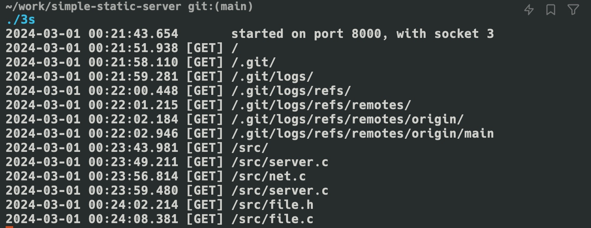

# Simple Static Server

A simple static server, now rewritten in Zig. The original C implementation has been moved to `legacy/src/`.



## Usage

```shell
make
./3s
```

Or run it directly with Zig:

```shell
zig build run -- .
```
